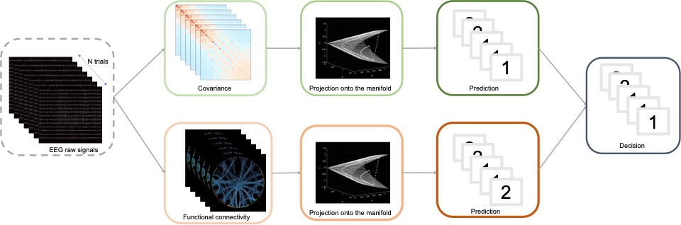
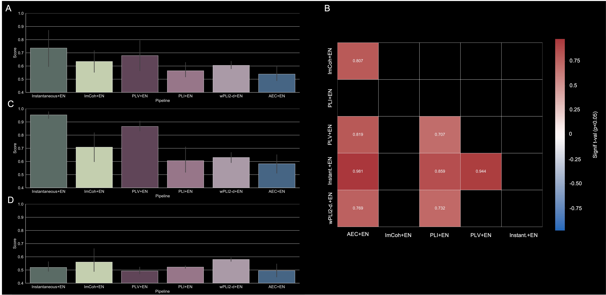
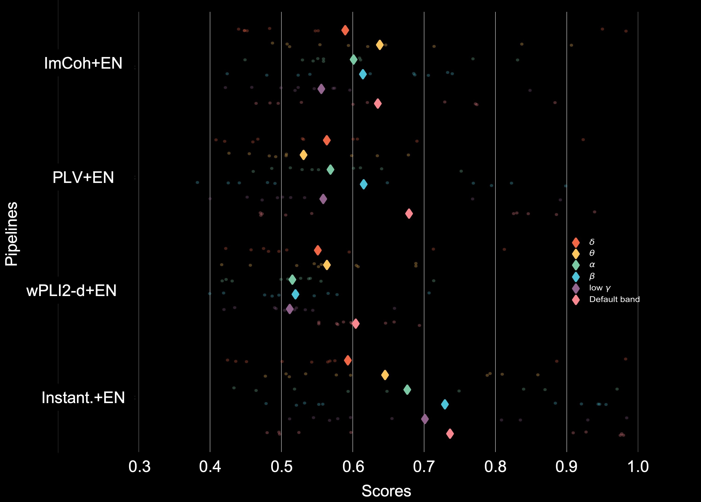

# Functional connectivity ensemble method to enhance BCI performance - FUCONE
---
This repository contains the code and supporting documents associated with the following manuscript:

IEEE version: https://ieeexplore.ieee.org/document/9722980
OA access: https://arxiv.org/abs/2111.03122

Please cite as:

Corsi, M.-C., Chevallier, S., De Vico Fallani, F. & Yger, F. (2022). Functional connectivity ensemble method to enhance BCI performance (FUCONE). IEEE TBME. http://doi:10.1109/TBME.2022.3154885

---
## Authors:
* [Marie-Constance Corsi](https://marieconstance-corsi.netlify.app), Postdoctoral Researcher, Aramis team-project, Inria Paris, Paris Brain Institute
* [Sylvain Chevallier](https://sylvchev.github.io), Associate professor, LISV, Paris-Saclay University
* [Fabrizio De Vico Fallani](https://sites.google.com/site/devicofallanifabrizio/), Research Scientist, Aramis team-project, Inria Paris, Paris Brain Institute
* [Florian Yger](http://www.yger.fr), Associate professor, LAMSADE, Paris-Dauphine University

---
## Abstract
Functional connectivity is a key approach to investigate oscillatory activities of the brain that provides important insights on the underlying dynamic of neuronal interactions and that is mostly applied for brain activity analysis. Building on the advances in information geometry for brain-computer interface, we propose a novel framework that combines functional connectivity estimators and covariance-based pipelines to classify mental states, such as motor imagery. A Riemannian classifier is trained for each estimator and an ensemble classifier combines the decisions in each feature space. 
A thorough assessment of the functional connectivity estimators is provided and the best performing pipeline, called FUCONE, is evaluated on different conditions and datasets. Using a meta-analysis to aggregate results across datasets, FUCONE performed significantly better than all state-of-the-art methods. The performance gain is mostly imputable to the improved diversity of the feature spaces, increasing the robustness of the ensemble classifier with respect to the inter- and intra-subject variability. 

---
## Data
All data associated with this manuscript are publicly available and can be found in the [Mother of all BCI Benchmarks (MOABB)](http://moabb.neurotechx.com/docs/index.html) here:
[http://moabb.neurotechx.com/docs/datasets.html](http://moabb.neurotechx.com/docs/datasets.html)

## Code
This repository contains the code used to run the analysis performed and to plot the figures.
To install all the packages used in this work you can directly type in your terminal:
`pip install -r requirements.txt`

---
## Figures

### Figure 1 - FUCONE approach 

*Generic view.*

### Figure 2 - Functional connectivity estimators

*(A) Group-level analysis. Barplots of the accuracy obtained over the group of ten subjects. (B) Group-level analysis. Statistical comparisons of each couple of pipelines. The color represents the significance level of the difference of accuracy obtained with two given pipelines associated to two specific FC estimators. (C) Subgroup analysis. Barplots of the obtained accuracy over the group of most responsive subjects (N=5 subjects). (D) Subgroup analysis. Barplots of the obtained accuracy over the group of least responsive subjects (N=5 subjects).*

### Figure 3 - Frequency bands - Group-level analysis

*For each pipeline, we plotted the distribution of the scores obtained over the subjects. Each color corresponds to a specific frequency band.*

### Figure 4 - Stacking classifiers for ensemble learning

*(A) Performance comparison between different combinations of pipelines and each FC estimator taken separately. Each bar corresponds to a specific configuration. (B) FUCONE approach. From EEG recordings, covariance, Instantaneous and ImCoh estimations are computed and classified with an Elastic-Net approach followed by an ensemble classifier relying on an Elastic-Net that provides the decision. (C) Comparison with the state-of-the-art. On the left, the bar plots represent the scores obtained from each pipeline at the group-level. The last two raincloud plots represent, for each pipeline, the distribution of the scores over the subgroups composed by respectively the most and the least responsive subjects.*

### Figure 5 - Replicability assessments and comparison with state-of-the-art pipelines

*(A) Within-session evaluation. On the left top, analysis performed with 2-class (lhrh stands for left hand vs right hand) datasets; on the left bottom, a comparison made with 2-class (rhf stands for right hand vs feet) datasets; on the right top, an analysis performed with 3-class datasets; on the right bottom, an analysis with 4-class datasets. (B) Cross-session evaluation. On the left, an analysis performed with 2-class (lhrh stands for left hand vs right hand) datasets; on the right, an analysis performed with 2-class (rhf stands for right hand vs feet) datasets. (C) Meta-effect assessment. Here we compared the two best pipelines: Cov+EN and FUCONE.*

